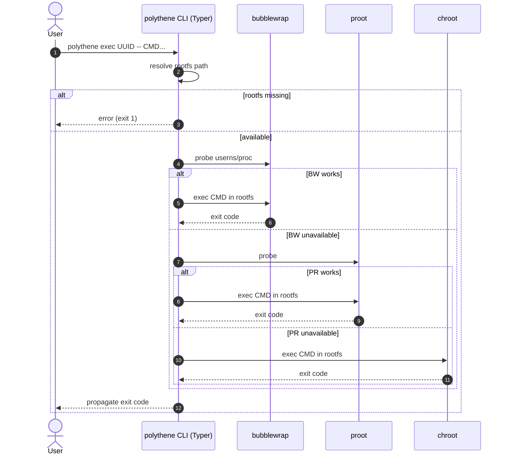

# Polythene design

## Overview

Polythene delivers a consistent workflow for system-level testing when working
inside environments with differing levels of privilege and isolation. The
Cyclopts-based CLI coordinates root file system staging, command execution, and
log reporting so that the same test suite can be executed in restrictive
sandboxes such as the Codex cloud and in container-friendly continuous
integration (CI) runners. This document records the architectural structure that
enables that behaviour and captures the trade-offs behind the current
implementation.

## Execution flow

Polythene prepares the execution environment by locating a stored root file
system (rootfs) and probing each supported backend until it finds one capable
of running the requested command. The probing sequence reflects the preference
for stronger isolation (bubblewrap) while still allowing execution in
toolchains that lack user namespace support (proot) or container primitives
(chroot).

For screen readers: The following sequence diagram outlines how the CLI
resolves a rootfs, probes bubblewrap and proot, and falls back to chroot when
needed before returning the resulting exit code to the caller.

## Core components

- **Cyclopts CLI:** Parses user input, resolves configuration, and emits
  commands for the backends while ensuring consistent exit codes across
  platforms.
- **Backend registry:** Encapsulates the bubblewrap, proot, and chroot
  integrations with shared probing and directory preparation helpers to remove
  duplicated logic.
- **Script utilities:** Provide filesystem and command helpers that are safe to
  consume both from installed packages and from ad-hoc scripts shipped in the
  repository.

## Design considerations

- **Deterministic fallbacks:** The backend probe order is deterministic so test
  outcomes remain reproducible even when multiple tools are available on the
  same host.
- **Minimal dependencies:** The project leans on Cyclopts and Plumbum to keep
  the CLI expressive without introducing heavyweight orchestration layers.
- **Documentation-first:** Behavioural specifications (pytest-bdd scenarios)
  describe the expected workflows, ensuring documentation and implementation
  stay aligned.
